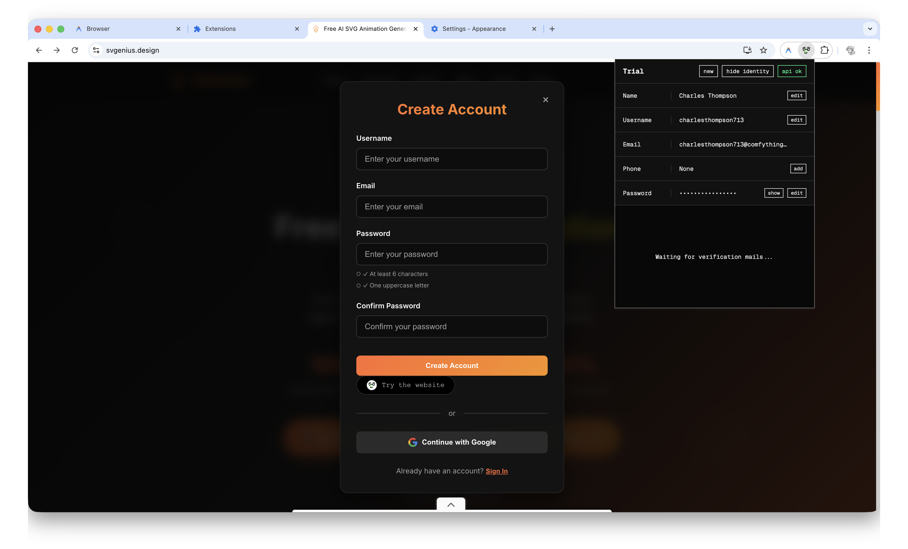
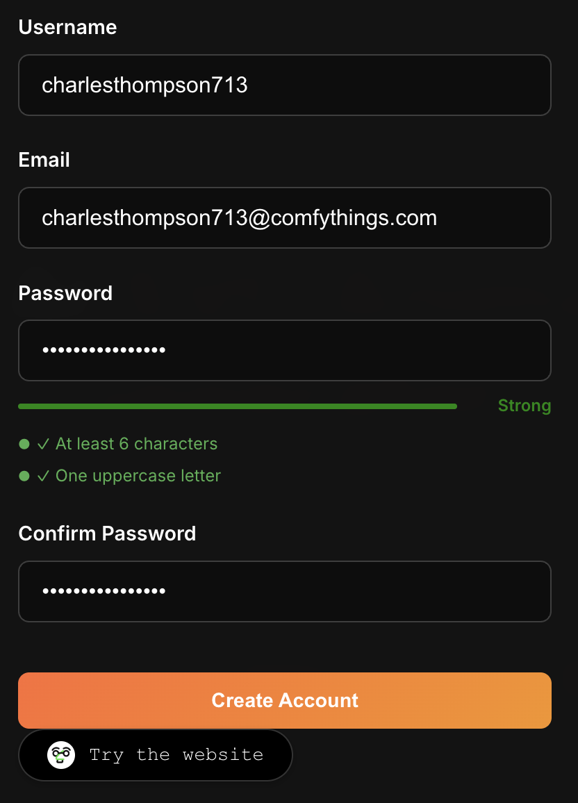

<div align="center">
  
  <h1>Trial</h1>
  <p>
    <strong>Identités Jetables & Emails Temporaires</strong>
  </p>
  <p>
    
    
  </p>
</div>

**Trial** est une extension Chrome conçue pour protéger votre vie privée en vous permettant de générer instantanément des identités jetables et des emails temporaires fonctionnels. Contournez les formulaires d'inscription invasifs sans compromettre vos données personnelles réelles.



## 🚀 Fonctionnalités

*   **Génération d'Identité Instantanée** : Créez un nom, un prénom, un nom d'utilisateur et un mot de passe sécurisé en un clic.
*   **Emails Temporaires Fonctionnels** : Intégration avec l'API Mail.tm pour générer de vraies adresses emails jetables.
*   **Boîte de Réception Intégrée** : Recevez vos emails de confirmation directement dans l'extension.
*   **Extraction Intelligente d'OTP** : L'extension détecte et extrait automatiquement les codes de vérification (OTP) pour une copie rapide.
*   **Remplissage Automatique (Autofill)** :
    *   **Menu Contextuel** : Clic-droit sur un champ -> "Trial: Auto-fill Form".
    *   **Bouton In-Page** : Un bouton "Try the website" apparaît discrètement sous les formulaires de connexion/inscription pour un remplissage en un clic.
*   **Design "Industrial Minimalist"** : Une interface sombre, épurée et performante.



## 🔒 Respect de la Vie Privée (Privacy First)

La philosophie de Trial est simple : **Vos données vous appartiennent.**

*   **Stockage Local Uniquement** : Toutes les identités générées sont stockées localement dans votre navigateur (`chrome.storage.local`). Aucune donnée n'est envoyée à des serveurs tiers (hormis l'interaction nécessaire avec Mail.tm pour les emails).
*   **Permissions Minimales** :
    *   `storage` : Pour sauvegarder votre identité courante.
    *   `alarms` : Pour vérifier périodiquement les nouveaux emails.
    *   `contextMenus` : Pour la fonctionnalité de remplissage automatique.
    *   `scripting` : Pour injecter les données dans les formulaires.
    *   `https://api.mail.tm/*` : Seule communication externe autorisée pour le service email.
*   **Transparence** : Le code est ouvert et auditable. Pas de traqueurs, pas d'analytique.

## 📦 Installation

Trial n'est pas encore disponible sur le Chrome Web Store. Vous pouvez l'installer en mode développeur :

1.  Clonez ce dépôt ou téléchargez le code source.
    ```bash
    git clone https://github.com/votre-username/trial-extension.git
    ```
2.  Ouvrez Google Chrome et accédez à `chrome://extensions`.
3.  Activez le **Mode développeur** (bouton en haut à droite).
4.  Cliquez sur **Charger l'extension non empaquetée** (Load unpacked).
5.  Sélectionnez le dossier du projet (`NDLI_ChromeExtension_Trial`).

## 🛠️ Utilisation

1.  Cliquez sur l'icône de l'extension pour ouvrir le panneau.
2.  Une identité est déjà générée. Cliquez sur "New Identity" pour en changer.
3.  Utilisez l'email généré pour vous inscrire sur un site.
4.  Attendez l'email de confirmation dans l'onglet "Inbox" de l'extension.
5.  Copiez le code OTP ou cliquez sur le lien de validation.
6.  Pour aller plus vite, utilisez le bouton "Try the website" injecté directement sur les pages de login !

## 📄 Licence

Ce projet est sous licence MIT. Voir le fichier [LICENSE](LICENSE) pour plus de détails.

## ✍️ Auteur

*   **MathieuDvv** - *Créateur & Design (Logo)* - [GitHub](https://github.com/MathieuDvv)
